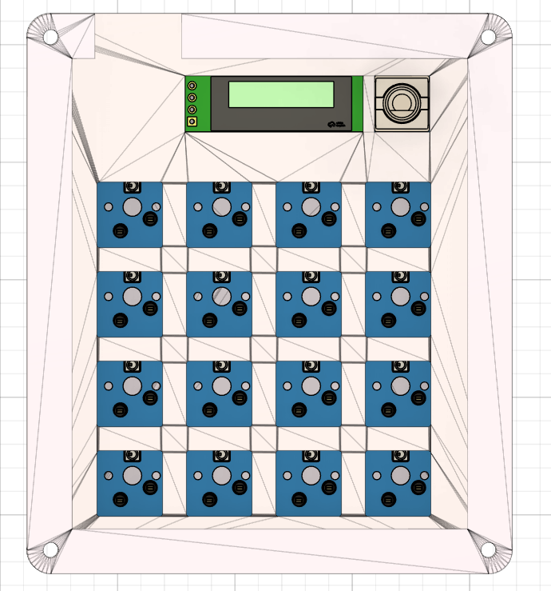
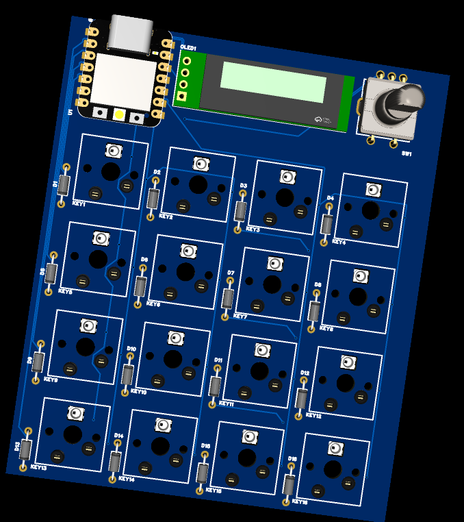
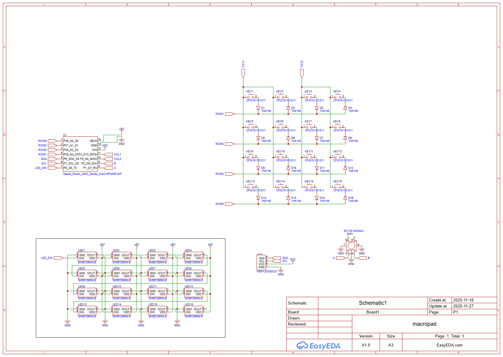

A macropad with 16 keys (hotswap!), 1 rotary encoder, per-key RGB and an OLED display.

Final build (pcb with case):

3D model of the PCB:

PCB:

Schematic:

BOM:
- 1x XIAO RP2040
- 1x 0.91" OLED
- 16x SK6812MINI-E LEDs
- 1x EC11 Rotary Encoder
- 16x Cherry MX switches
- 16x Cherry MX keycaps
- 16x CPG151101S11 Kailh hotswap sockets
